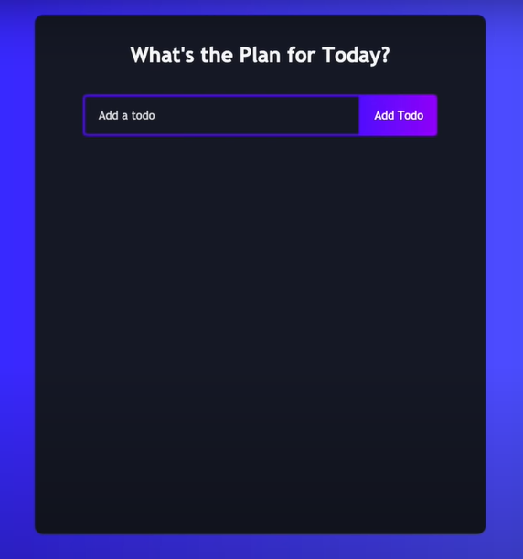
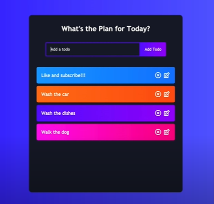
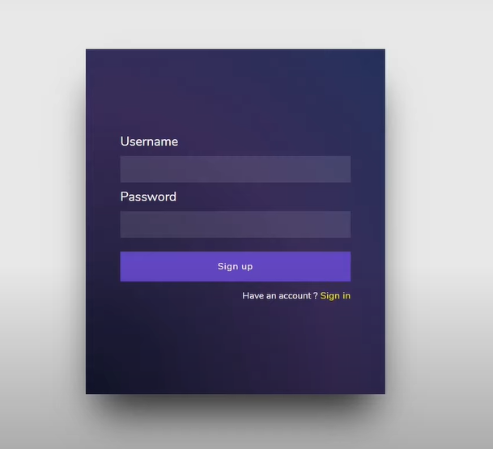

# TodoApp

Tech Stack Used -- Reactjs , CSS , MaterialUI , Firebase

Authentication with Firebase

For Demo --

Clone this repo using --
$ git clone <url>
  
$ cd <this folder>
  
$ npm install
  
